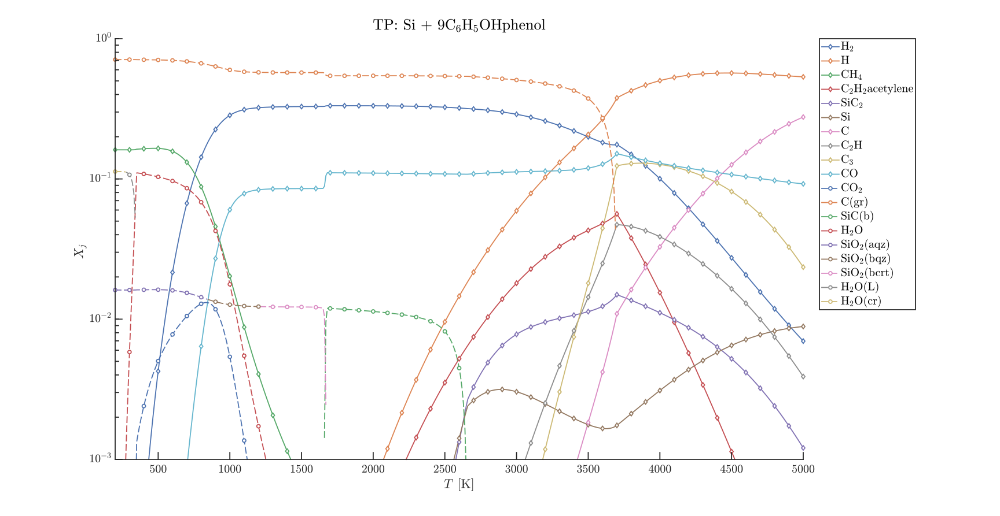
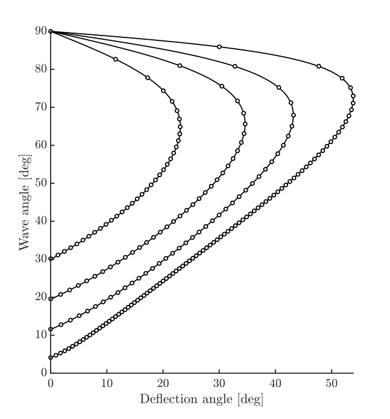
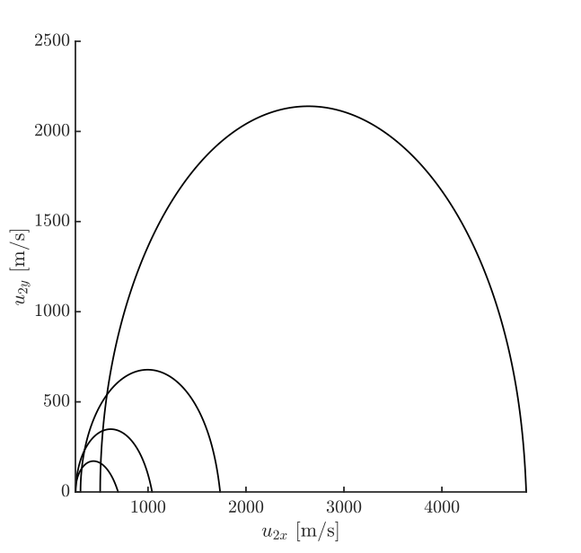

# Combustion Toolbox: An open-source thermochemical code for gas- and condensed-phase problems involving chemical equilibrium

**Authors**
Alberto Cuadra, César Huete, Marcos Vera

**Affiliations**
Departamento de Ingeniería Térmica y de Fluidos, Universidad Carlos III de Madrid, Spain

**Corresponding author**
acuadra@ing.uc3m.es (A. Cuadra)

**Website for online documentation**
https://combustion-toolbox-website.readthedocs.io/en/latest/

**Repository for source code**
https://github.com/AlbertoCuadra/combustion_toolbox

---
**Note: This README file is written in [Markdown](https://guides.github.com/features/mastering-markdown/). Please use a Markdown editor to visualize it properly. Otherwise, you can use the [online version](https://github.com/AlbertoCuadra/combustion_toolbox_sample) of this file.**

---

## 1. Source code

The source code of the Combustion Toolbox (CT) is organized in the following folders:

```terminal
.combustion_toolbox
|-- databases
|-- examples
|-- gui
|-- installer
|-- modules
|-- utils
|-- validations
|-- run_test.m
|-- CODE_OF_CONDUCT.md
|-- CONTENTS.m
|-- CONTRIBUTING.md
|-- CONTRIBUTORS.md
|-- INSTALL.m
|-- LICENSE.md
`-- README.md
```

The `databases` folder mainly consists of raw data and *.mat* files that contain the thermochemical properties of the individual chemical species. The `examples` folder includes various examples that demonstrate the wide variety of problems that can be solved with CT. The `gui` folder contains the routines that are specifically designed for the GUI. The `installer` folder contains all the installation files of the GUI: the MATLAB toolbox and the royalty-free stand-alone version. The `modules` folder contains the functions of the different modules, CT-EQUIL, CT-SD, and CT-ROCKET, as well as the routines for initializing CT. The `utils` folder houses utility functions with different purposes. Finally, the `validation` folder includes the routines used to validate CT with the results obtained with other codes, the unit testing files to ensure the correct functionality of the code, and all the graphs generated from these verifications.

Regarding the files in the main source folder, we have the following: the file `run_test.m` runs the unit tests of CT. The file `CONTENTS.m` is a script that briefly describes the problems that can be solved with CT. The file `INSTALL.m` is a script that installs the CT code and the GUI. The file `LICENSE.md` contains the license of CT (GNU General Public License v3.0). Finally, the file `README.md` is the official description in the GitHub repository.


Additionally, we have included a `sample` folder that contains two subfolders, `input` and `output`. The `input` folder contains the input files for the examples described below in Sec. 3. The `output` folder contains the expected figures to be obtained.

For an accurate description of each routine included in the code, please refer to the [online documentation](https://combustion-toolbox-website.readthedocs.io/en/latest/documentation/functions/index.html). For a detailed description of the output, please refer to the manuscript.

Lastly, if there is any question, unexpected behavior, or bug in the code, please use the add-on uifeedback (**we do not collect any data from the sender, it can be totally anonymous**, e.g., as email write @test.com). It can be started by writing in the prompt:
```matlab
uifeedback()
```


## 2. Installation

Combustion Toolbox can be installed with the provided `INSTALL.m` file. Here is how to install the toolbox:

1. Navigate to the directory where the code is located.
2. Run the `INSTALL.m` file using the following command in the MATLAB Command Window:

```matlab
INSTALL()
```

3. This will add the necessary folders to the MATLAB path and also install the Combustion Toolbox GUI. 

Now, Combustion Toolbox can be used using MATLAB. To verify that the installation was successful, please write in the prompt:
```matlab
self = App
```
which will show in MATLAB's command window:
```matlab
Loading NASA database ... OK!
NASA database with thermo loaded from main path ... OK!

self = 

  struct with fields:

            E: [1×1 struct]
            S: [1×1 struct]
            C: [1×1 struct]
         Misc: [1×1 struct]
           PD: [1×1 struct]
           PS: [1×1 struct]
           TN: [1×1 struct]
    DB_master: [1×1 struct]
           DB: [1×1 struct]
```

For a more detailed description of the installation process, please refer to the [online documentation](https://combustion-toolbox-website.readthedocs.io/en/latest/install.html).

## 3. Examples

As described in the manuscript, CT includes a wide variety of examples and validations in the `examples` and `validations` folders, respectively. In this section, we will describe how to run a simple using MATLAB's desktop environment and the GUI. Additionally, we will show how to run two of the validations carried out in the manuscript. 

### 3.1 Example 1:

For this first case, we are going to perform a parametric study of the adiabatic isobaric combustion of acetylene and air at standard conditions ($T = 300$ K, $p = 1$ atm) for a wide range of equivalence ratios $\phi \in [0.5, 4]$. This case corresponds with Fig. 4 in the manuscript.

#### Using the Desktop Environment

Let's write the following code in the prompt (or run `example_1.m` in the `sample/input` folder):
```matlab
% Initialize
self = App('Soot formation extended');
% Initial conditions
self = set_prop(self, 'TR', 300, 'pR', 1, 'phi', 0.5:0.01:4);
self.PD.S_Fuel = {'C2H2_acetylene'};
self.PD.S_Oxidizer = {'N2', 'O2'};
self.PD.ratio_oxidizers_O2 = [79, 21] ./ 21;
% Additional inputs (depends on the problem selected)
self = set_prop(self, 'pP', self.PD.pR.value); 
% Solve problem
self = solve_problem(self, 'HP');
% Miscellaneous
self.Misc.display_species = {'CO2', 'CO', 'H2O', 'H2', 'O2', 'N2',...
                             'HCN', 'H', 'OH', 'O', 'CN', 'NH3', 'CH4', 'C2H4',...
                             'CH3', 'NO', 'HCO', 'NH2', 'NH', 'N', 'CH', 'Cbgrb'};
% Display output (plots)
post_results(self);
```

This will show a summary of the thermodynamic properties and composition of the mixture in the MATLAB Command Window, and the following figures (the expected output is located in './sample/output/example_1' folder):

<p align="left">
    
</p>

**Figure 1.** Variation of the molar fractions $X_j$ for an HP transformation in lean-to-rich acetylene (C$_2$H$_2$)-air mixture at standard conditions ($T_1 = 300$ K, $p = 1$ bar).

<p align="left">
    
</p>

**Figure 2.** Variation of different thermodynamic properties (from left to right): temperature, $T$, pressure, $p$, density, $\rho$, enthalpy, $h$, internal energy, $e$, Gibbs energy, $g$, entropy, $s$, and adiabatic index, $\gamma_s$, for an HP transformation in lean-to-rich acetylene (C$_2$H$_2$)-air mixture at standard conditions ($T_1 = 300$ K, $p = 1$ bar).


**Note:** This parametric study should take at most 4-6 seconds.

#### Using the GUI

The previous example can also be easly performed using the GUI. To do so, we need to run the GUI using the following command in the MATLAB 
```matlab
combustion_toolbox()
```
or running it directly from MATLAB's Apps tab.


Once the GUI is started, we should see something similar to the following window:

<p align="left">
    
</p>

**Figure 3.** Example of how to configure the GUI to reproduce the results of Example 1.

As we can observe, the previous already includes the necessary inputs to perform the parametric study. The steps to complete the parametric analysis are the following:

1. Go to the `Quick settings` sub-tab and check the item called `Ideal Air`. With this option, we consider that air is composed of 79% of N$_2$ and 21% of O$_2$ on molar basis.
2. Return to the `inputs` sub-tab and select `Acetylene + Air` as the reactant.
3. Select the list of possible species as products. In this case, we will select a predefined list of species called `Soot formation Extended`, which includes 94 species that typically appear in CHON reactions.
4. Define the parameter to be varied. In this case, we will vary the equivalence ratio $\phi$ from 0.5 to 4 with a step of 0.05 (decreased to 0.01 for smoother plots). This can be written as `0.5:0.05:4` or with square brackets `[0.5:0.05:4]`.
5. Define the problem to be solved. In this case, we will solve the problem for an HP transformation called `HP: Adiabatic T and composition at constant P`.
6. Run the calculation by clicking the `Run` button. The default initial state of the mixture corresponds with the standard conditions ($T_1 = 300$ K, $p = 1$ bar).

Once the calculation is finished, the lamp located at the bottom of the window should turn green. The results can be visualized in the `results` tab. 

By clicking the sub-tab `Parameters` and selecting the first case from the tree object, we should see the following:

<p align="left">
    
</p>

**Figure 4.** Post-processing the results of `Example 1` through the GUI (part I). In particular, the thermodynamic properties correspond to the case selected in the tree object ($\phi = 0.5$).

By clicking the sub-tab `Molar composition` we can observe the molar composition of the mixture (reactants and products):

<p align="left">
    
</p>

**Figure 5.** Post-processing the results of `Example 1` through the GUI (part II): In particular, the chemical composition corresponds to the case selected in the tree object ($\phi = 0.5$).

Lastly, the GUI also allows us to visualize the results more interactively. To do so, we need to click the `Custom Figures` sub-tab. Then by selecting the mixture to be plotted as the products (strP), the equivalence ratio as the parameter to be varied in the x-axis (phi), and the temperature as the property to be plotted in the y-axis (T), we should obtain the following figure:

<p align="left">
    
</p>

**Figure 6.** Post-processing the results of `Example 1` through the GUI (part III).

### 3.2 Example 2: 

This problem consists of a parametric study of a Si-C$_6$H$_5$OH mixture at atmospheric pressure ($p = 1$ atm) for a wide range of temperatures $T \in [200, 5000]$, which corresponds with Fig. 5 in the manuscript. The results obtained with CT are contrasted with values obtained with the Chemical Equilibrium with Applications (CEA) code.

Writing in the prompt:
```matlab
run_validation_TP_CEA_6()
```
will show two predefined figures (the expected output is located in './sample/output/example_2' folder):

<p align="left">
    
</p>

**Figure 7.** Variation of the molar fractions $X_j$ for a Silica-Phenolic mixture at atmospheric pressure ($p = 1$ atm) with $T \in [200, 5000]$; solid line: numerical results obtained with CT; symbols: numerical results obtained with NASA's CEA.


<p align="left">
    
</p>

**Figure 8.** Variation of different thermodynamic mixture properties (from left to right): density, $\rho$, enthalpy, $h$, internal energy, $e$, Gibbs energy, $g$, specific heat capacity at constant pressure, $c_p$, specific heat capacity at constant pressure, $c_v$, adiabatic index, $\gamma_s$, derivative of the volume with pressure at constant temperature, $(\mathrm{d}v/\mathrm{d}p)_T$, and derivative of the volume with the temperature at constant pressure, $(\mathrm{d}v/\mathrm{d}T)_p$, for a Silica-Phenolic mixture at atmospheric pressure ($p = 1$ atm) with $T \in [200, 5000]$; solid line: numerical results obtained with CT; symbols: numerical results obtained with NASA's CEA.

**Note:** This parametric study should take 5-7 seconds at most.

### 3.3 Example 3:

For this case, we will obtain the pressure ratio-deflection angle and the incidence angle-deflection angle shock polar diagrams for dry air (consisting of 78\% N$_2$, 21\% O$_2$, and 1\% Ar) initially at room conditions ($T_1 = 300$ K, $p_1 = 1$ atm) at different pre-shock Mach numbers $\mathcal{M}_1$ = (2, 3, 5, 14). The results obtained with CT are compared with Caltech's SD-Toolbox, which uses Cantera as the kernel for the thermochemical calculations.

Run the following script:
```matlab
run_validation_SHOCK_POLAR_SDToolbox_2
```
which will show the following figures (the expected output is located in './sample/output/example_3' folder):

<p align="left">
    
</p>

**Figure 9.** Pressure-deflection shock polar diagrams for air (78\% N$_2$, 21\% O$_2$, and 1\% Ar) at pre-shock temperature $T_1 = 300$ K and pressure $p_1 = 1$ atm, and a range of pre-shock Mach numbers $\mathcal{M}_1$ = (2, 3, 5, 14); solid line: calorically imperfect gas with ionization/dissociation; circles: results obtained with Cantera within Caltech's SD-Toolbox; diamonds: maximum deflection angle $\theta_{\rm max}$.

<p align="left">
    
</p>

**Figure 10.** Wave angle-deflection ressure-deflection shock polar diagrams for air (78\% N$_2$, 21\% O$_2$, and 1\% Ar) at pre-shock temperature $T_1 = 300$ K and pressure $p_1 = 1$ atm, and a range of pre-shock Mach numbers $\mathcal{M}_1$ = (2, 3, 5, 14); solid line: calorically imperfect gas with ionization/dissociation; circles: results obtained with Cantera within Caltech's SD-Toolbox; diamonds: maximum deflection angle $\theta_{\rm max}$.

<p align="left">
    
</p>

**Figure 11.** Post-shock velocity $u_2$ polar diagrams for air (78\% N$_2$, 21\% O$_2$, and 1\% Ar) at pre-shock temperature $T_1 = 300$ K and pressure $p_1 = 1$ atm, and a range of pre-shock Mach numbers $\mathcal{M}_1$ = (2, 3, 5, 14).

**Note:** This parametric study should take 5-7 seconds at most.